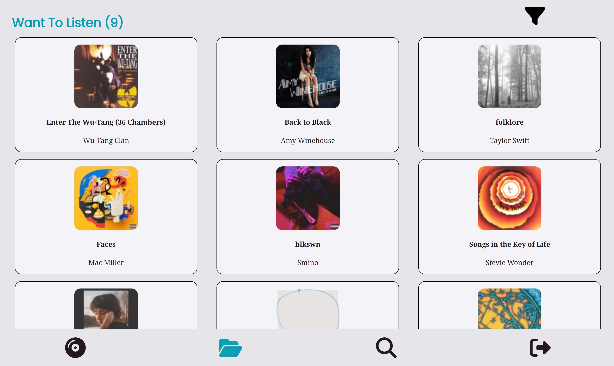
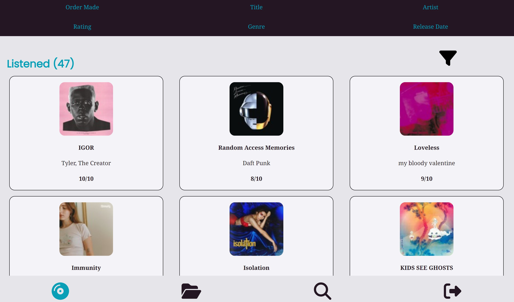

# Rotations

- I started developing Rotations becuase I listen to a lot of music and I wanted an easy place to track all of it. You can start using rotations [here](https://album-organizer-8305f.web.app/). Rotations is compatible with both mobile and desktop!

  And all you need is a Google Account!

## How to Use

- In rotations you can save albums that you want to listen to later by storing them in the Want To Listen to section.
  

- You can then move the albums over into the Listened section once you get around to hearing them.
- In both sections you can sort the albums in various different ways as shown below.
  

- To find these albums, you can use the search feature.

## Development

- I used HTML, CSS, and JavaScript to make the web interface for Rotations.
- For the database I used Firebase and I used the Spotify Search API to search for the music albums.
